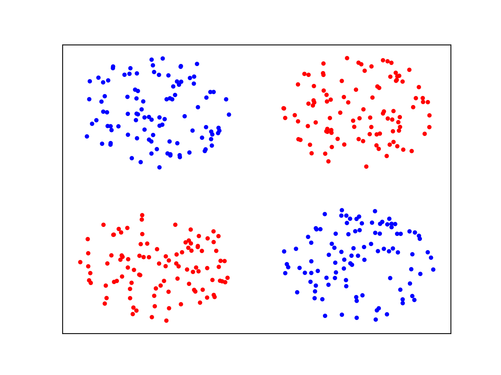
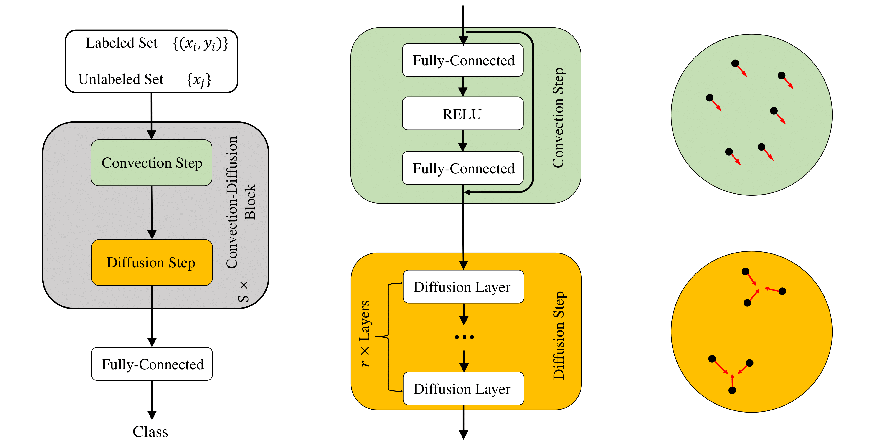

# Diffusion Mechanism in Neural Network: Theory and Applications

This repository contains the code for Diff-ResNet implemented with PyTorch. 

More details in paper:
[**Diffusion Mechanism in Neural Network: Theory and Applications**](https://arxiv.org/abs/2105.03155)

## Introduction
Inspired by the diffusive ODEs, we propose a novel diffusion residual network (Diff-ResNet) to strengthen the interactions among data points. Diffusion mechanism can decrease the distance-diameter ratio and improves the separability of data points. Figure below shows the evolution of points with diffusion.
<div align=center>

</div>

The network structure is described in the figure below
<div align=center>

</div>

## Synthetic Data
We offer several toy examples to test the effect of diffusion mechanism and for users to understand how to use diffusion in a **plug-and-play** manner. 

They can serve as minimal working examples of diffusion mechanism. Simply run each python file.

## Graph Learning
Code is adapted from [**gnn-benchmark**](https://github.com/shchur/gnn-benchmark/tree/master/gnnbench). Users can test our Diff-ResNet on dataset cora, citeseer and pubmed for 100 random dataset splits and 20 random initializations each. One should provide step_size and layer_num.

```
python train.py --num_splits 100 --num_inits 20 --dataset cora --step_size 0.25 --layer_num 20 --dropout 0.25
```

## Few-shot
### 1. Dataset
Download the [miniImageNet](https://drive.google.com/open?id=0B3Irx3uQNoBMQ1FlNXJsZUdYWEE), [tieredImageNet](https://drive.google.com/file/d/1g1aIDy2Ar_MViF2gDXFYDBTR-HYecV07/view) and [CUB-100](http://www.vision.caltech.edu/visipedia-data/CUB-200-2011/CUB_200_2011.tgz). 

Unpack these dataset into corresponding directory in [fewshot/data/DATASET_NAME](./fewshot/data/mini) . 

[fewshot/data/DATASET_NAME/split/](./fewshot/data/mini/split) directory contains csv splitting files for each dataset.

### 2. Backbone Training
You can download pretrained models on base classes from [here](https://drive.google.com/uc?id=1q6PjG9N7BWSaBzyy1lPA6bxygIKkTOQI&export=download), and unpack pretrained models in [./fewshot/saved_models/](./fewshot).

Or you can train from scratch by running [fewshot/backbone/train_backbone.py](./fewshot/backbone/train_backbone.py). You can manually tune the parameters for each dataset or backbone. 
```
python train_backbone.py --dataset mini --backbone resnet18
```

### 3. Diff-ResNets Classification
Run [train.py](./fewshot/train.py) with specified arguments for few-shot classification. See [train.py](./fewshot/train.py) for help with each argument.
```
python train.py --dataset mini --backbone resnet18 --shot 1 --method simple
python train.py --dataset mini --backbone resnet18 --shot 1 --method laplacian
python train.py --dataset mini --backbone resnet18 --shot 1 --method diffusion --step_size 0.5 --layer_num 5 --n_top 8 --sigma 4 --alpha 0.0
```
## Citation
If you find Diff-ResNets useful in your research, please consider citing:
```
@article{wang2021diff,
  title={Diff-ResNets for Few-shot Learning: an ODE Perspective},
  author={Tangjun Wang, Zehao Dou, Chenglong Bao and Zuoqiang Shi},
  journal={arXiv preprint arXiv:2105.03155},
  year={2021}
}
```
